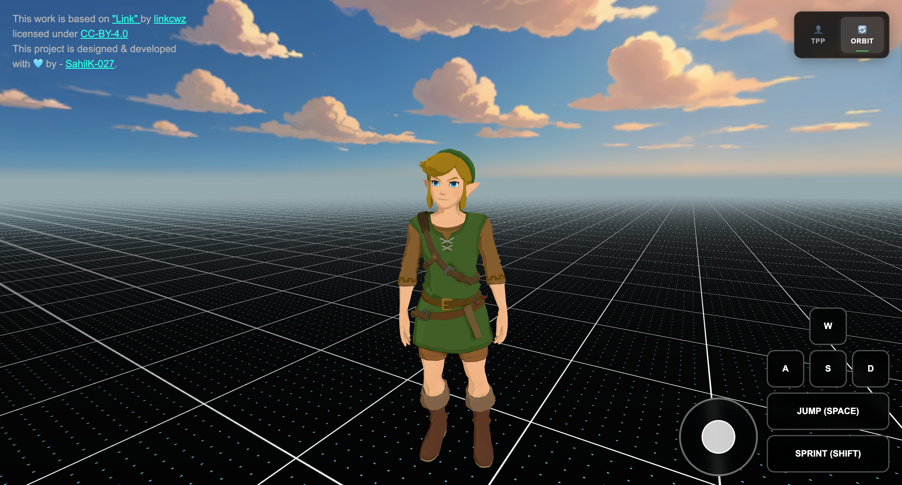

# Third Person Camera Controller



A third person camera controller with dual camera modes and cross-platform controls built with Three.js.

## Features

- **Dual Camera Modes**: TPP (Third Person) and Orbit modes with smooth transitions
- **Cross-Platform Controls**: Desktop keyboard/mouse + mobile touch controls
- **Virtual Joystick**: Mobile-friendly joystick with tap-to-jump functionality
- **Visual Feedback**: On-screen buttons highlight when keyboard keys are pressed
- **Responsive UI**: Clean interface that adapts to different screen sizes

## Tech Stack

- **Three.js** - 3D graphics library
- **Vite** - Build tool and dev server
- **lil-gui** - Debug interface
- **SCSS** - Styling
- **three-perf** - Performance monitoring
- Built on top of: [threejs-gamedev-template](https://github.com/SahilK-027/threejs-gamedev-template)

## Getting Started

### Prerequisites

- Node.js (v16 or higher)
- npm or yarn

### Installation

1. Clone the repository

```bash
git clone <your-repo-url>
cd TPP-Orbit-Camera-Controller
```

2. Install dependencies

```bash
npm install
```

3. Start the development server

```bash
npm run dev
```

4. Open your browser and navigate to `http://localhost:5173`

## Controls

### Desktop

- **WASD/Arrow Keys** - Move player (buttons highlight when pressed)
- **Space** - Jump
- **C Key** - Switch camera modes
- **Mouse** - Camera rotation (Orbit mode)

### Mobile

- **Virtual Joystick** - Drag to move, tap to jump
- **Jump/Sprint Buttons** - Dedicated action controls
- **Camera Toggle** - Switch between TPP/Orbit modes
- **Touch & Drag** - Camera rotation (Orbit mode)

## Camera Modes

- **TPP Mode**: Camera follows behind player for gameplay
- **Orbit Mode**: Free camera rotation around player for inspection
